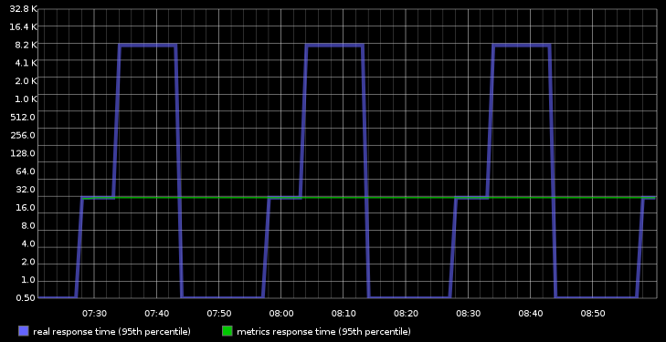
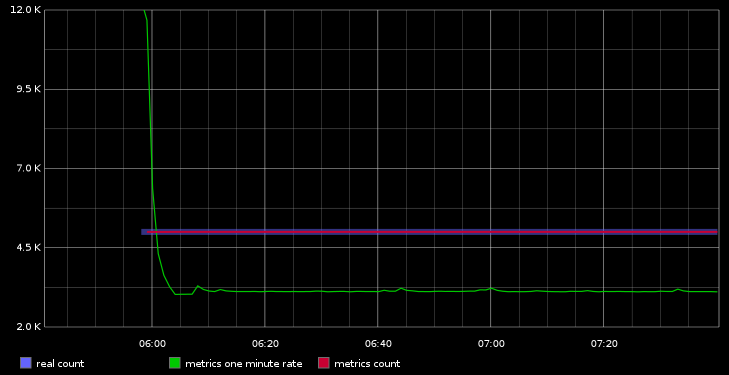
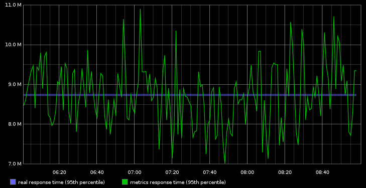
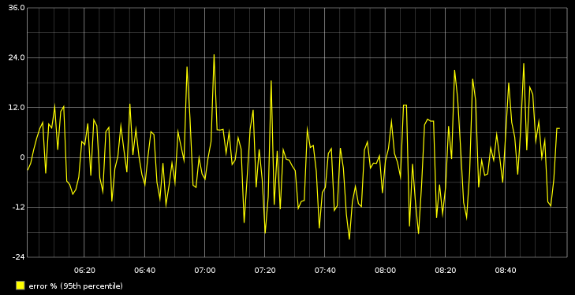

#Metrics edge cases

Upon code reviewing Metrics framework some of the implementation questions were raised and as a result the following "edge case"
scenarios were developed to highlight problems. These might be bugs in the code, limitations of algorithms
or just my misunderstandings and improper usages. It would be nice to get some answers from developers behind Metrics framework.

**Implementation notes:**

- In every scenario below there is a "scheduled reporter" that reports metrics in "Graphite" format every minute.
- The "real" or "base line" 95th percentile is calculated as `values[values.length * 0.95]`.
- Code requires java 7.

## Scenario 1

### Summary
When reporting Timer values the last reported value gets "stuck" and is being reported even if there are no
more new values are recorded for prolonged period of time. This might be confusing.
It appears that SlidingTimeWindowReservoir addresses this problem but in this case we end up hooked on "unbound" data structure.

### Simulation
There is a process that starts every 20 minutes and runs for 5-10 minutes. It performs some operation which response time
is recorded by Timer.

### Charts
Response times are reported even when there is no activity

## Scenario 2

### Summary
In this scenario Timer completely misses the spike in 95th percentile response time. Also "one minute rate" is fading rather slowly
which may be confusing too.

### Simulation
There is a process that starts every 30 minutes and runs for about 20 minutes. Every time process starts it runs "normally"
exhibiting response time of 30ms. Then "something happens" in the system and process's response time jumps to 15000ms
and is sustained on this level for the next 10 minutes. 95th percentile reported by Timer completely misses the jump in
response time and keeps reporting 30ms through out the entire lifetime of the process.

### Charts
Timer missed spike in response time

Chart has logarithmic scale and that's why all zero values were replaced with 0.5. In other words 0.5 really means zero.

Timer.getOneMinuteRate() fades slowly which may be confusing

##Scenario 3

### Summary
This scenario shows that you need to understand what you are reporting and what surprises you may run into if you don't
understand implementation specifics.

1. Based on the method name itself one may decide that Timer.getOneMinuteRate() returns a rate per minute.
As a matter of fact it really is an "exponential moving average of the 5 second rate over one minute period".
In order to get a count of events happened within a minute one would better to use Timer.getCount() and rely on
backend system like graphite to properly display one minute rate.
2. Reservoir sampling (which is the basis for Timer implementation) does not
do a good job in terms of accuracy. It is distribution dependent and ~25% error margin
for 95th percentile was observed on the sample set of values. Even greater error margin is observed for higher percentiles.

### Simulation
There is a precalculated set of 5000 values. They are being recorded as "Timer" values. This process repeats every minute
recording the exact same set of values in the same sequence.

### Charts
Timer.getOneMinuteRate() is not the same as count per minute. Timer.getOneMinuteRate() reports ~4200 counts per minute vs 5000 real count.
This initial spike to ~33000 a minute rate (went through the roof) makes little sense either. Timer.getCount() matches real count though!

Reservoir sampling response time vs real response time

Reservoir sampling can be quite inaccurate. Up to 25% error margin on 95th percentile

